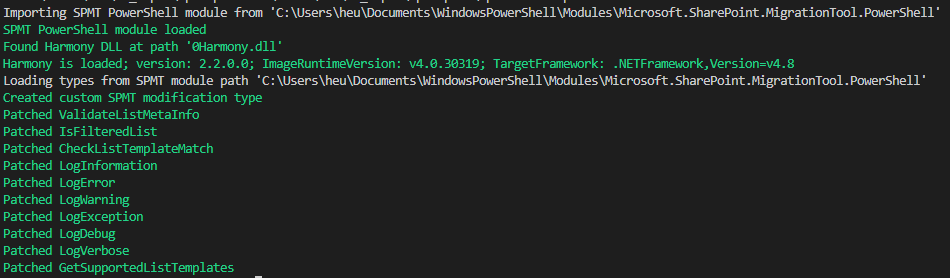

# SPMT+

Patches the [SharePoint Migration Tool (SPMT)](https://docs.microsoft.com/en-us/sharepointmigration/introducing-the-sharepoint-migration-tool) to support additional list and document library types.
## Background

The SharePoint Migration Tool only supportes certain SharePoint list templates.

[Here's](https://docs.microsoft.com/en-us/sharepointmigration/sharepoint-migration-supported-list-templates) a list of supported template IDs that looks like this (excerpt):

|**List template ID**|**Name**|**Description**|**Supported by SPMT**|
|:-----|:-----|:-----|:-----|
|-1|InvalidType|Not used. Value = -1|No|
|0|NoListTemplate|unspecified list type. Value = 0|No|
|100|GenericList|Custom list. Value = 100|Yes|
|101|DocumentLibrary|Document library. Value = 101|Yes|
||*Snip - lots of entries here*||
|1220|HealthRules|Health Rules. Value = 1220|No|
|1221|HealthReports|Health Reports. Value = 1221|No|
|1230|DeveloperSiteDraftApps|Draft Apps library in Developer Site. Value = 1230|No|

The *Supported by SPMT* column tells whether a type of list is supported or not. If you want to migrate one of those types you will be out of luck with SPMT.

## Use case

We had to migrate document libraries created by a SharePoint on-prem solution that were basically normal document libraries. They behaved like ID 101 (which is *DocumentLibrary*) but internally they've got an ID like 10015. This is not supported by SPMT.

We ended up patching SPMT to force it to migrate those libraries nevertheless.

## How SPMT normally rejects certain lists and libraries

SPMT internally has several checks in place to ensure it only migrates supported lists and libraries.

SPMT uses a whitelist of supported list template types. It also excludes lists based on their title (like "Style Library") and on metadata like "is a catalog". There are also checks for mismatches between the source list type and the destination list type (if it already exists). Certain mappings are supported, most not. Same goes for content types. Some special content types are force-mapped to more generic content types, but most aren't.

## How does the patching script work

The patcher script disables the checks that SPMT does that prevented our lists from being migrated.

It uses the Harmony library (https://github.com/pardeike/Harmony) to modify the SPMT PowerShell cmdlets in memory. Harmony is able to add additional logic before and after methods of other .NET applications (which SPMT is). See the [Harmony documentation](https://harmony.pardeike.net/) for details on how this works.

The following checks are modified:

- additional types are added to the list of supported list template types (you must add your type here)
- disabling the check for unsupported list names
- disabling the check for unsupported catalog lists
- disabling the list template type mismatch check by setting the source list template type to the target list template type (this might not work for your scenario)

There are some side effects, e.g. the check for audience targeted lists is also disabled rendering the option of SPMT to ignore those lists impossible. Other side effects might occur.

## How to use this script

Make sure the prerequisites are in place and run the script.
### Prerequisites

- install the *SharePoint Migration Tool* first - it comes with PowerShell cmdlets you will use to migrate (sorry, no UI)
  - note: those cmdlets will be patched
- download Harmony and extract the *0Harmony.dll* from the [zip file](https://github.com/pardeike/Harmony/releases/tag/v2.2.0.0) (I successfully used the net4.8 variant):
    - put 0Harmony.dll in the same folder as the script _or_ in the current directory; the script looks in both places

### Run the script

- the console should be free of red error messages and only contain green or white status messages
- include this script into your migration script to patch SPMT before starting the migration with *Start-SPMTMigration*
- the script can be safely run multiple times

A successful script run will look like this:

This script has been tested with:
- Visual Studio Code with PowerShell extension
    - note: VS Code sometimes liked to crash after restarting the PowerShell session - just restart VS Code in this case
    - note: PowerShell ISE should also work
- SPMT 3.5.123.3
- PowerShell 5.1
- Harmony 2.2.0.0, .NET 4.8 DLL
- SharePoint 2013 Server to SharePoint Online migration

### Configuration

`[SpmtModifications]::ActivatePatches` can be used to activate or deactivate the majority of patches.

`[SpmtModifications]::SkipViews` can be used to skip all list views from migration.

`[SpmtModifications]::LogToConsole` can be used to toggle console output for log messages. Note: console output interfers with the SPMT progress indicator in Visual Studio Code.

## Notes

Add additional list template types you need to the `GetSupportedListTemplatesPostfix` method. Other checks for title etc. are already completely disabled.

Since I couldn't get the SPMT to produce a decent log file I also patched the logging methods and write the log output to the `spmtplus.log` file that will be created in the current directory.

Some log messages will also be written to the console, check the methods like `LogDebugPrefix` to modify this as you wish.

You can see and modify all of this additional functionality in the patch script!
## More list template information
- the list of SharePoint list template types supported by SPMT can be seen here: https://docs.microsoft.com/en-us/sharepointmigration/sharepoint-migration-supported-list-templates
- a list of SharePoint list template types can be seen here: https://docs.microsoft.com/en-us/dotnet/api/microsoft.sharepoint.splisttemplatetype?view=sharepoint-server (it does not contain all)
- other monikers for "list template type" are BaseTemplate, BaseTemplateId, ListTemplate and ListTemplateType

## Disclaimer

Use at your own risk. Migrating all lists might now be possible, but does not always make sense. List functionality that is backed by code will not run on SharePoint Online. Certain content types may behave differently in SPO than on-prem. Side effects might occur that surface outside the tested scope.

I recommend using the patched SPMT to only migrate those lists and libraries that require patching and to carefully check the results. Otherwise you should use the unpatched version.

## Note to Microsoft

Please open source the SharePoint Migration Tool as this would make things easier. Thank you.